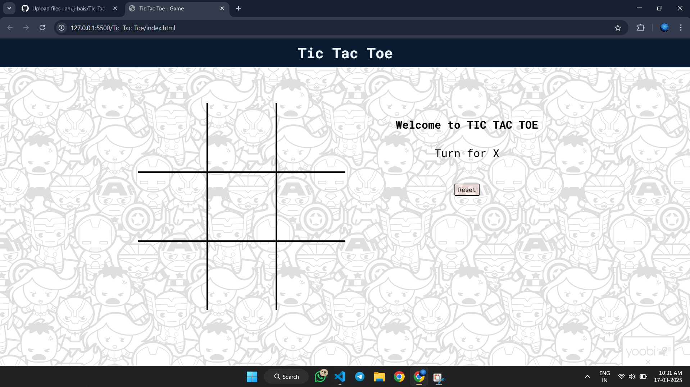

# 🎮 Tic Tac Toe Game

## 📜 Description
This is a **Tic Tac Toe** game built using **HTML, CSS, and JavaScript**. Play against a friend in this classic two-player game and try to get three in a row! ❌⭕

## ✨ Features
- 🆚 Two-player mode.
- 🎨 Interactive and responsive UI.
- 🔄 Reset button to restart the game.
- 🏆 Displays winner or declares a draw.
- 📱 Mobile-friendly design.

## 🛠 Technologies Used
- **📝 HTML** – Structure of the game.
- **🎨 CSS** – Styling and layout.
- **⚡ JavaScript** – Game logic and interactivity.

## 🎯 How to Play
1. Open the `index.html` file in a web browser. 🌐
2. Player 1 (❌) and Player 2 (⭕) take turns clicking on an empty cell.
3. The first player to get **three in a row** (horizontally, vertically, or diagonally) wins! 🏆
4. Click the **Reset** button to play again. 🔄

## 📁 File Structure
```
tic-tac-toe/
│── index.html       # 🎭 Game UI
│── style.css        # 🎨 Styling
│── script.js        # ⚡ Game logic
```

## 📸 Screenshots
Here's a preview of the game:
(Game Starting State)



(Winning State)


## 🚀 Future Enhancements
- 🤖 Add AI mode to play against the computer.
- 🌙 Dark mode toggle.

